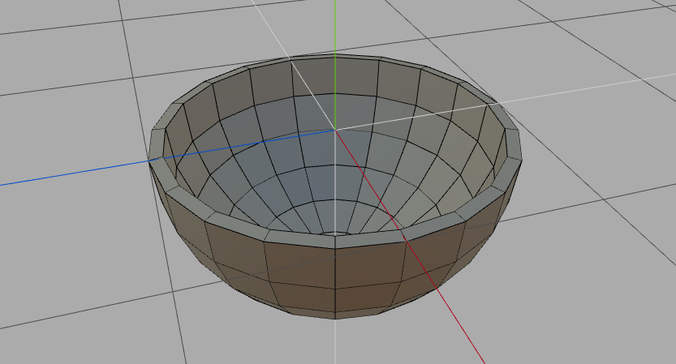
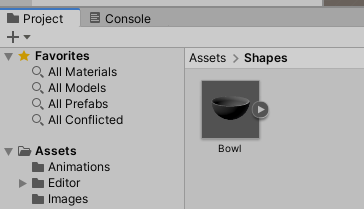
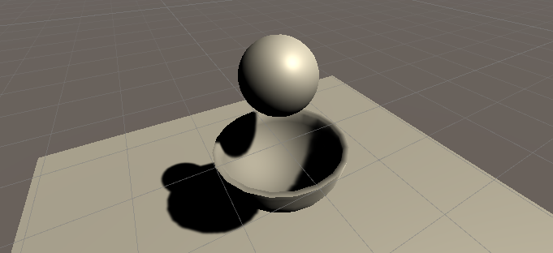
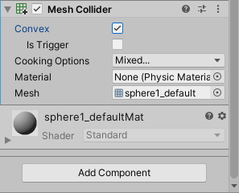
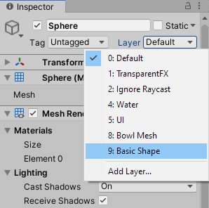
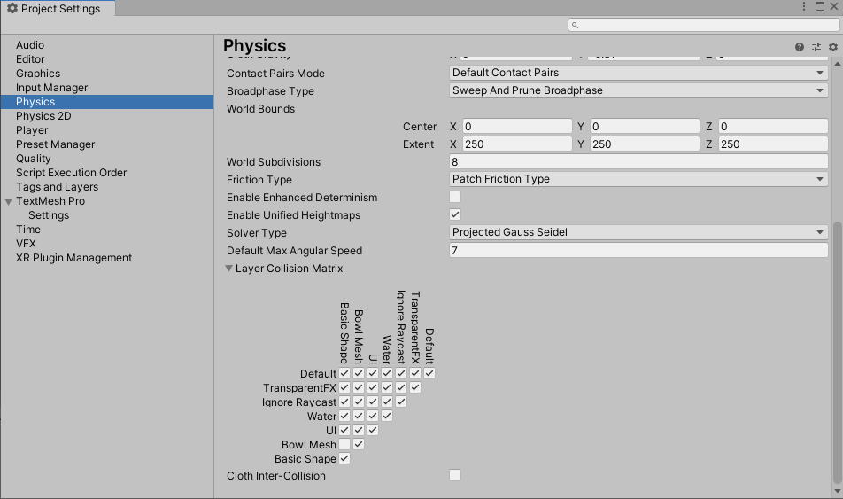
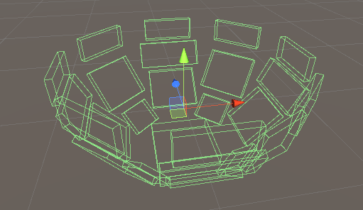
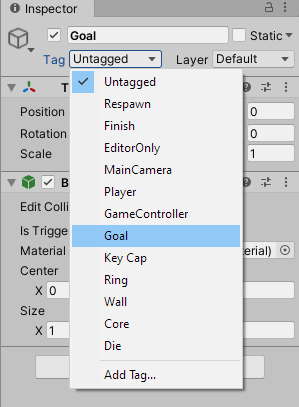

# Unity Tutorials

## Working with Bowl-Shaped Objects

Unity only provides a few simple 3D objects in the form of spheres, cubes, and cylinders. Anything beyond that is up to you to build in a separate 3D modeling program like [Wings 3D](http://www.wings3d.com/) or [Blender](https://www.blender.org/). This tutorial isn't about how to model non-primitive shapes but rather how to work with them once you import them into Unity.

For instance, in one of my games I wanted the player to try to get a ball to fall into a bowl, where both objects are affected by the physics engine and move freely about. Getting the bowl to behave correctly wasn't as straightforward as I had hoped, but my workaround still got the job done!

To start, I used Wings 3D to create a bowl, as seen in the following image:



You can also [download the completed bowl object here](./assets/Bowl.obj).

Drag and drop the `Bowl.obj` file into your Unity Assets via the Project pane. It should look like the following image:



From there, you can drag and drop the object into the scene to render a bowl in the game. If you expand the `Bowl` object in the Hierarchy pane, you'll see that it already includes a child object as such:

```text
📦 Bowl
   📦 sphere1_default
```

The name `sphere1_default` is a carryover from Wings 3D. Select the child `sphere1_default` object and add a new Mesh Collider component using the Inspector pane. This will inform Unity to use the shape of the `sphere1_default` mesh when calculating collisions.

At this point, you can add some other objects to the scene to help with testing. Add a `Plane` object underneath the bowl and a `Sphere` object above the bowl. Your setup should look like the following image:




Give the sphere a Rigidbody component so it will adhere to gravity. Press Play and watch the ball successfully collide with the bowl. Mission accomplished!

But wait, the ultimate goal was to make the bowl movable, as well. Select the parent `Bowl` object and add a Rigidbody component to it. If you press Play, you'll get the following error:

```text
Non-convex MeshCollider with non-kinematic Rigidbody is no longer supported since Unity 5.
If you want to use a non-convex mesh either make the Rigidbody kinematic or remove the Rigidbody component.
```

Unfortunately, rigid bodies and concave shapes (like bowls) don't play nicely anymore. On the `sphere1_default` Mesh Collider component, you'll need to check the box next to Convex, as the following image shows:



This will essentially close off the mouth of the bowl, so the ball can no longer fall inside. That doesn't mean mesh colliders aren't useful. It will still help in allowing the bowl to roll across other surfaces or be pushed by outside forces. We'll just need to come up with a different way for the ball, specifically, to interact with the bowl so it can fall inside.

First, let's disable collisions between the ball and mesh collider. We can accomplish this by using layers. Select the `Sphere` object and use the Layer dropdown in the Inspector pane to add a new layer called "Basic Shape" and then use the dropdown again to set the layer to "Basic Shape." It should look like the following image:



Do the same with the `sphere1_default` mesh collider, creating and then assigning a layer called "Bowl Mesh."

Next, go to Edit > Project Settings > Physics and scroll down to the Layer Collision Matrix section. Uncheck collisions between "Basic Shape" and "Bowl Mesh," as the following image shows:



Now the bowl's mesh collider will still interact with the rest of the game world but ignore the ball. We'll rebuild a collider specifically for the ball. Fair warning: this is the tedious part!

Right click the `Bowl` object in the Hierarchy pane and select "Create Empty." Rename the empty object to "Bottom" and add a Box Collider component to this object. Use the `sphere1_default` mesh as a guide to resize and position the `Bottom` object so that it overlaps with the bottom of the mesh.

You'll then need to create several more empty box colliders to basically rebuild the skeletal structure of the bowl. The end result should look something like the following image:



Similarly, your bowl's child objects will start looking like this:

```text
📦 Bowl
   📦 sphere1_default
   📦 Bottom
   📦 Rim
   📦 Rim (1)
   📦 Rim (2)
   📦 etc.
```

You might not need as many box colliders as I ended up using, though. My original plan was to rely on this skeleton alone for all collisions, which is why I tried to plug up every hole. Only later did I realize I could still leverage the mesh collider for non-ball collisions.

And that's it! You now have a custom bowl that can successfully catch another object. But how do you know _when_ the ball is inside the bowl?

On the parent `Bowl` object, add one more empty object and rename it to "Goal." Add a Box Collider component again but make sure to set this one to Is Trigger. Position the `Goal` object near the bottom of the inside of the bowl. In the object's Inspector pane, use the Tag dropdown to create and add a tag called "Goal," as the following image shows:



Next, create a new C# script in your Assets folder and attach the script to the `Sphere` object. In the `.cs` file, add the following method:

```csharp
private void OnTriggerEnter(Collider other)
{
  // ball collided with the goal object
  if (other.tag == "Goal")
  {
    Debug.Log("You win!");
  }
}
```

Play the scene and watch the console for the message to appear. Now try positioning the bowl upside down over the ball, so it falls on top. The message will probably still trigger, because they _did_ touch, even though this shouldn't be a valid win condition. We'll need to make sure the bowl is upright.

One way to know the bowl is upright is if the ball's `y` position is greater than the bowl's `Bottom` object position. Let's update the `OnTriggerEnter()` method to find the `Bottom` object and compare coordinates:

```csharp
private void OnTriggerEnter(Collider other)
{
  // ball collided with the goal object
  if (other.tag == "Goal")
  {
    // find bottom object
    Transform bottom = other.gameObject.transform.parent.Find("Bottom").transform;
    
    // compare y coordinates
    if (bottom.position.y < transform.position.y) 
    {
      Debug.Log("You win!");
    }
  }
}
```

Congratulations, the bowl is complete! Custom shapes in Unity can definitely be tricky. If you want further practice with custom shapes, see what you can do with this [Ring object](./assets/Ring.obj) that I had created for the same game.

Good luck!
